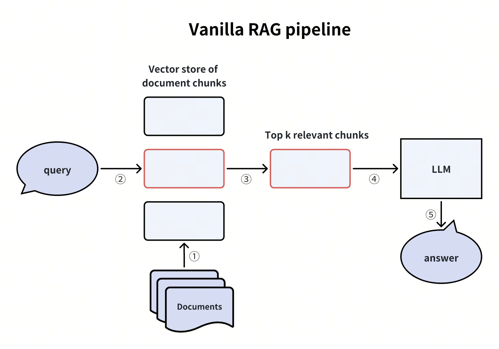

# Milvus Demo

[](https://colab.research.google.com/drive/1XIhijEtjHcgaIgA2vnrFZJhqNWzf0thg#scrollTo=Pez10whM9Elc)   

📦 **[Install PyMilvus](https://milvus.io/docs/install-pymilvus.md)** | 📦 **[Milvus Lite](https://milvus.io/docs/milvus_lite.md)**

> **Note:** All project requirements are listed in `requirements.txt` and will be automatically installed in the container during the build process.

## Background

📊 **[How Fast is Vector Search Compared to Traditional Search?](https://milvus.io/ai-quick-reference/how-fast-is-vector-search-compared-to-traditional-search)**

# Prerequisites 

To run this project, follow these steps:

1. **Configure environment variables:**
   Copy the `.env.example` file to create your `.env` file:
   ```bash
   cp .env.example .env
   ```
   Then open the `.env` file and replace the placeholder token with your GitHub Personal Access Token (PAT). This is required for authentication in the project.

2. **Start the Docker environment:**
   ```bash
   docker compose up --build
   ```
   This command builds and starts all the necessary services, including the Milvus database and Jupyter notebook server.

3. **Copy the documentation files into the container:**
   ```bash
   docker exec notebook-milvus mkdir -p /notebooks/milvus_docs/en/ && docker cp milvus_docs/en/faq notebook-milvus:/notebooks/milvus_docs/en/faq
   ```
   This command creates the required directories and copies the Milvus FAQ documentation into the container, which is needed for the RAG demo.

Once the container is running, you can access the Jupyter notebook interface and run the demo examples.

## Examples

This project includes two demo notebooks in the `/examples` directory:

### 1. **simpleDemo.ipynb** - Basic Milvus Operations
A foundational example that demonstrates core Milvus functionality:
- **Creating a Collection**: Set up a new Milvus collection with a specified dimension
- **Inserting Data**: Add sample vector data with associated metadata (text and subject fields)
- **Searching**: Query the collection with a vector and filter results by conditions
- **Deleting Data**: Remove records from the collection

This demo is ideal for understanding the basic workflow of working with Milvus.

### 2. **RAGDemo.ipynb** - Retrieval-Augmented Generation (RAG)
An example showcasing Milvus integration with Large Language Models and embeddings:
- **Generating Embeddings**: Uses OpenAI embeddings to convert text into vector representations
- **Document Processing**: Reads documentation files (Milvus FAQ docs) and creates embeddings for them
- **Collection Management**: Creates and populates a Milvus collection with embedded documents
- **Semantic Search**: Queries the collection with natural language questions to retrieve relevant context
- **RAG Integration**: Uses retrieved documents as context to generate accurate answers with an LLM

This demo illustrates a real-world use case for combining Milvus vector search with AI models to build intelligent question-answering systems.



